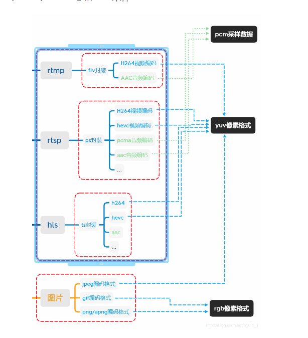
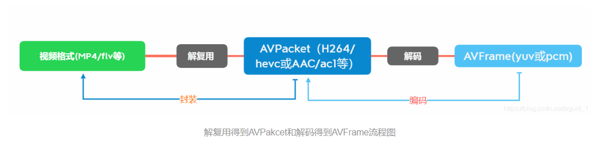

wvp-GB28181-pro

图像像素格式（简称像素格式），一般指的是没有经过编码的按照原始像素排列的数据。
举个栗子，一个完整图像的像素排列一般是这样的（以4*4像素的rgb像素格式为例）：
rgbrgbrgbrgb
rgbrgbrgbrgb
rgbrgbrgbrgb
rgbrgbrgbrgb

图片封装格式指的我们日常见到的png，jpg，bmp，gif等等图片格式。
其中bmp是无损格式且不压缩，里面的数据格式就是图片头信息加上rgb排列的像素数据；png是无损压缩格式；jpg/gif等都是有损压缩格式。
压缩图片可以有效节省更多的硬盘空间。

2、图像？视频帧？
图像像素数据指的是yuv、rgb，rbga，bgr，gbra等图像像素格式，经过编码后才是视频帧。
比如我们常见的h264编码，编码其实就是对图像像素数据的压缩，（以rgb为例，假如当前图像像素尺寸为1920*1080，
每种颜色用一个字节表示，也就是说每个像素点有红绿蓝三色共3字节，图像有1920*1080个像素点，也就是说这张图像大小为1920*1080*3字节，
显然数据太大了），可以这样理解，h264编码本质上就是一种图像数据压缩算法。
补充：视频帧中常常提到的I帧，B帧和P帧指的是什么？i帧也叫关键帧，实际上就是一张完整的静态图像，而B帧和P帧只是用来记录画面的运动矢量等非图像数据，B/P帧都需要依赖i帧才能够正确解码出完整图像（有损的图像画面）。在实际应用中各种视频源中很少使用B帧，原因是虽然使用大量B帧可以提高压缩率，但也会消耗更多的硬件性能，所以大多数情况下的视频源都以i帧（关键帧）和大量P帧为主。
另外在直播应用中i帧间隔会很低，这样能够更快的显示首帧画面（B/P帧需要i帧才能够解码），但是这样也增加了传输的数据量，因为一个i帧通常会很大。

3、编码？封装？
编码上面已经讲了，是一种压缩算法；那么封装格式又是什么呢，封装格式就是我们日常见到的视频文件了，比如mp4，avi，mkv，flv等等等，按照每种封装格式的规范把视频帧和音频按照一定顺序存起来就成我们日常看到的视频文件了，这些封装格式一般都会包含一些头/尾标识和一些视频描述信息，这样播放器读取视频文件的时候就知道该怎么播放这些视频文件了（可以把封装格式理解成收纳箱，上面贴着小纸条说明里面放了哪些东西）。
压缩图片格式也可以参考视频编码格式，原理都一样，都是对图像数据做有损/无损压缩。

什么是转封装？为什么转封装比转码消耗更少？为什么转封装无法改动视频尺寸？
先举个栗子：假设视频格式(mp4,flv,avi等)是盒子，里面的视频编码数据(h264,hevc)是苹果，我们把这个苹果从盒子里取出来放到另一个盒子里，盒子是变了，苹果是没有变动的，因此视频相关的尺寸数据是没有改动的，这个就是转封装的概念。
有了上面这个例子，我们可以把“转码”理解为：把这个盒子里的苹果(hevc)拿出来削皮切块后再加工成樱桃(h264)后再装到另一个盒子里，多了一步对苹果(hevc)转换为樱桃(h264)的操作，自然比直接把苹果拿到另一个盒子（转封装）要消耗更多机器性能。

4、音/视频源
音/视频源可以是视频文件、音频文件，流媒体源，设备等等。
采集设备的图像数据（从源设备采集到的是像素数据，一般是bgr或者rgb像素数据）如果是某些厂商的商用摄像机，可能会支持rtsp/rtmp协议，要采集声音呢，就得采集录音/话筒设备里面的数据（一般是pcm采样数据）。

5、流媒体协议
rtsp协议栈，rtmp协议栈，hls，http-flv（理论上讲这个flv不能算是流媒体协议，它只是个无限大的flv文件）等等。
例如rtmp，对编码后的音视频帧，要对其进行封装成flv进行传输。
补充：说到底这些协议原理上依然是建立在tcp/udp基础上的应用层传输协议。

6、流媒体服务
支持音视频存储分发的服务都可以叫流媒体服务。
比如常见的srs（开源的rtmp流媒体服务，当然它支持rtmp/hls/http-flv的分发）和
nginx（通过安装模块可以支持rtmp，hls，http-flv分发），除此之外的收费的和一些不太友好的开源流媒体服务就不一一介绍了。

音视频像素、编码、格式和协议及图片知识概念关系图：
流媒体协议层：rtsp、rtmp、hls
封装格式层：flv、ps、ts、图片格式（jpeg,png,gif）
音/视频编解码层：h264(AVC)、h265(HEVC)、h266(VVC)、AAC、PCMA
图像像素格式和音频采样层：YUV、RGB、RGBA等和PCM采样

三、JavaCV是如何封装了FFmpeg的音视频操作？
JavaCV通过JavaCPP调用了FFmpeg，并且对FFmpeg复杂的操作进行了封装，把视频处理分成了两大类：“帧抓取器”（FrameGrabber）和“帧录制器”（又叫“帧推流器”，FrameRecorder）以及用于存放音视频帧的Frame（FrameFilter暂且不提）。
整体结构如下：
视频源---->帧抓取器（FrameGabber）---->抓取视频帧（Frame）---->帧录制器（FrameRecorder）---->推流/录制---->流媒体服务/录像文件

1、帧抓取器（FrameGrabber）
封装了FFmpeg的检索流信息，自动猜测视频解码格式，音视频解码等具体API，并把解码完的像素数据（可配置像素格式）或音频数据保存到Frame中返回。
2、帧录制器/推流器（FrameRecorder）
封装了FFmpeg的音视频编码操作和封装操作，把传参过来的Frame中的数据取出并进行编码、封装、发送等操作流程。
3、过滤器（FrameFilter）
FrameFilter的实现类其实只有FFmpegFrameFilter，因为只有ffmpeg支持音视频的过滤器操作，主要封装了简单的ffmpeg filter操作。
4、Frame
用于存放解码后的视频图像像素和音频采样数据（如果没有配置FrameGrabber的像素格式和音频格式，那么默认解码后的视频格式是yuv420j，音频则是pcm采样数据）。
里面包含解码后的图像像素数据，大小（分辨率）、音频采样数据，音频采样率，音频通道（单声道、立体声等等）等等数据
Frame里面的一个字段opaque引用AVFrame、AVPacket、Mat等数据，也即是说，如果你是解码后获取的Frame，里面存放的属性找不到你需要的，可以从opaque属性中取需要的AVFrame原生属性。
例如：
Frame frame = grabber.grabImage();//获取视频解码后的图像像素，也就是说这时的Frame中的opaque存放的是AVFrame
AVFrame avframe=(AVFrame)frame.opaque;//把Frame直接强制转换为AVFrame
long lastPts=avframe.pts();
System.err.println("显示时间："+lastPts);
补充：
FFmpeg中两个重要的结构体：AVPacket、AVFrame。
AVPacket:是ffmpeg中存放解复用（未解码）的音视频帧的结构体，视频只有可能是一帧，大小不定（分为关键帧/I帧、P帧和B帧三种视频帧）。
AVFrame:属性除了包含音视频帧以外，还包含：pts(显示时间)、dts(解码时间)、duration（持续时长）、stream_index（表示音视频流的通道，音频和视频一般是分开的，通过stream_index来区分是视频帧还是音频帧）、
flags（AV_PKT_FLAG_KEY（值是1）：关键帧，2-损坏数据，4-丢弃数据）、pos（在流媒体中的位置）、size
某些情况下，使用AVPacket直接推流（不经过转码）的过程称之为：转封装。
AVFrame是ffmpeg中存放解码后的音视频图像像素或音频采样数据的结构体，大部分属性是与Frame相同的，多了像素格式、pts、dts和音频布局等等属性。
AVPakcet和AVFrame的使用流程如下图所示：

JavaCV把opencv的操作分成了两大块：OpenCVFrameGrabber和OpenCVFrameRecorder。其中OpenCVFrameGrabber用来读取设备、视频流媒体和图片文件等，而OpenCVFrameRecorder则用来录制文件。
1、OpenCVFrameGrabber读取设备、媒体文件及流
OpenCVFrameGrabber其实内部封装了opencv的VideoCapture操作，支持设备、视频文件、图片文件和流媒体地址（rtsp/rtmp等）。
可以通过 ImageMode设置色彩模式，支持ImageMode.COLOR（色彩图）和ImageMode.GRAY（灰度图）
注意：opencv并不支持音频读取和录制等操作，只支持视频文件、视频流媒体、图像采集设备的画面抓取。 另外需要注意的是，读取非动态图片，只能读取一帧。
通过OpenCVFrameRecorder的grab()抓取到的图像是Frame，其实javaCV内部通过OpenCVFrameConverter把opencv的Mat转换为了Frame，也即是说，Frame中可以直接获取Mat或者也可以通过OpenCVFrameConverter实现Mat和Frame的互转。

2、OpenCVFrameGrabber获取的Frame和Mat之间的关系
OpenCVFrameGrabber既然内部封装的是opencv的VideoCapture，那么获取的数据结构应该是Mat，通过OpenCVFrameGrabber源码也证实了这一点，那么我们如何直接获取Mat呢？
实际上在OpenCVFrameGrabber中把获取到的Mat转换为Frame，并且在Frame中使用opaque字段引用了**Mat**结构体。
在使用OpenCVFrameGrabber获取Frame的时候不需要再进行Frame和Mat转换，Mat img=(Mat)frame.opaque;即可获得Mat结构体。

3、OpenCVFrameRecorder录制媒体文件
opencv的录制支持的视频编码fourCC的编码集请参考：
OpenCVFrameRecorder主要封装了opencv的VideoWriter模块，用来实现视频流媒体的录制操作，支持的格式同样参考：
通过循环recordFrame就可以录制视频流媒体，当然如果是进行图像处理操作，得到的是mat，就可以通过OpenCVFrameConverter把Mat转换成Frame即可进行record()录制操作。

4、OpenCVFrameConverter进行Mat、 IplImage和Frame的互转
由于我们使用opencv需要进行图像处理等操作，处理完得到的是Mat或者IplImage，读取和录制却是Frame，所以需要使用OpenCVFrameConverter提供的转换操作来完成两个对象间的转换操作。
注意：此转换操作实际上常用于FFmpeg获取到的视频图像转换为Mat，因为OpencvFrameGrabber本身获取到的Frame包含Mat的引用，参考上面的“OpenCVFrameGrabber获取的Frame和Mat之间的关系”

IplImage与Frame互转
//把frame转换成IplImage
IplImage convertToIplImage(Frame frame)
//把IplImage转换成frame
Frame convert(IplImage img)

Mat与Frame互转
//把frame转换成Mat
Mat convertToMat(Frame frame)
//把Mat转换成frame
Frame convert(Mat mat)

